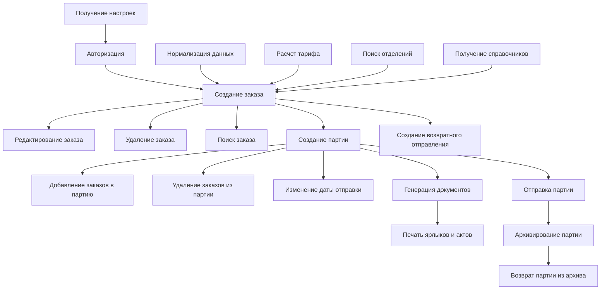
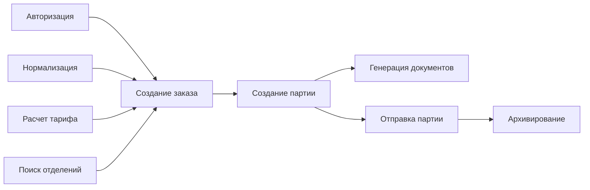

# Flow работы с API Почты России (otpravka.pochta.ru)

## Основные этапы бизнес-процесса

1. **Авторизация**
   - Получение токена и ключа авторизации
2. **Создание заказа**
   - Ввод и нормализация данных
   - Расчет тарифа
   - Поиск отделения
3. **Работа с заказом**
   - Редактирование
   - Удаление
   - Поиск
4. **Создание партии**
   - Добавление заказов в партию
   - Удаление заказов из партии
   - Изменение даты отправки
5. **Генерация документов**
   - Формирование ярлыков, актов, форм Ф103, Ф7п, Ф112ЭК
6. **Отправка партии**
   - Передача партии в отделение
7. **Архивирование**
   - Перевод партии в архив
   - Возврат партии из архива
8. **Возвраты**
   - Создание возвратного отправления
9. **Справочные методы**
   - Получение настроек, справочников, поиск отделений

---

## Диаграмма бизнес-процесса

### Альтернативная диаграмма (если первая не работает)

---

## Краткое описание этапов

- **Авторизация** — получение доступа к API.
- **Нормализация данных** — проверка и корректировка адреса, ФИО, телефона.
- **Расчет тарифа** — расчет стоимости и сроков доставки.
- **Поиск отделений** — определение подходящего отделения для отправки.
- **Создание заказа** — формирование отправления.
- **Работа с заказом** — редактирование, удаление, поиск.
- **Создание партии** — группировка заказов для массовой отправки.
- **Генерация документов** — формирование ярлыков, актов, форм.
- **Отправка партии** — сдача партии в отделение.
- **Архивирование** — завершение работы с партией, хранение истории.
- **Возвраты** — оформление возвратных отправлений.
- **Справочные методы** — получение настроек, справочников, информации об отделениях. 